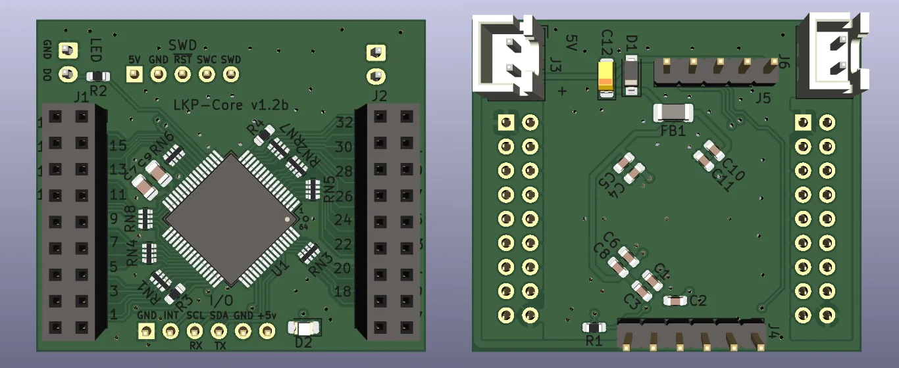

# LKP

レンくんピアノ (Len-kun Piano)

Capacitive touch slider controller for rhythm games.

# Contents

## pcb/LKP-Core

Microcontroller board for use with LKP electrode boards. Supports up to 32 channel of self capacitance input. Includes a WS281x LED driver channel with protection resistor. Supports I2C or UART as communication methods.

For sample firmware for use with LKP-Core, see [LKP-FW](https://github.com/Project-Alpaca/LKP-FW).

Requires KiCad version 5.99 (nightly) (supports `kicad_pcb format >= 20210816`).

### Pin mapping

I/O port:

| \#  | Description |
| --- | ----------- |
|  1  | GND |
|  2  | INT |
|  3  | SCL/RX |
|  4  | SDA/TX |
|  5  | GND |
|  6  | +5V |

WS281x LED connector:

| \#  | Description |
| --- | ----------- |
|  1  | GND |
|  2  | LED |

SWD connector:

| \#  | Description |
| --- | ----------- |
|  1  | VTARG |
|  2  | GND |
|  3  | RESET |
|  4  | SWCLK |
|  5  | SWDIO |

## pcb/LKP-Diva-Electrode-Tile

Electrode board for Project DIVA Future Tone slider controller. Works as a 2-tile setup. Both tiles use the same design, with right tile being a 180 degree rotated version of the left tile.

Requires KiCad version 5.99 (nightly) (supports `kicad_pcb format >= 20210228`) for hatched fills.

# BOM

## LKP-Core

- **C1, C4, C6, C10**: Generic 1uF 0603 X5R ceramic capacitor. (I used `CC0603KRX5R8BB105`)
- **C2, C3, C5, C8, C11**: Generic 100nF 0603 ceramic capacitor. (I used `CL10B104KA8NNNC`)
- **C7**: `GRM2195C1H103JA01D`.
- **C9**: `GRM21B5C2J222FWAAL`.
- **C12**: Generic 10uF EIA-3216-18 tantalum capacitor.
- **D1**: Generic SOD-123 Schottky diode (`MBR0520L`).
- **D2**: Generic 0805 LED (yellow color).
- **FB1**: Generic 1206 ferrite bead (330ohm@100MHz).
- **J1, J2**: Straight female .1" header 2x9.
- **J3**: JST XH 2 positions.
- **J4**: Straight male .1" header 1x6.
- **J5**: Straight male .1" header 1x5.
- **J6**: **Angled** male .1" header 1x2 or JST XH 2 positions
- **R1**: Generic 1kohm 5% 0603 resistor.
- **R2**: Generic 470ohm 5% 0603 resistor.
- **R3, R4**: Generic 560ohm 5% 0603 resistor.
- **RN\***: Generic 560ohm 5% 0402x4 convex resistor array (I used `4D02WGJ0561TCE`).
- **U1**: `CY8C4246AZI-M445` (or `CY8C4247AZI-M485`, Needs minor firmware modifications).

## LKP-Diva-Electrode-Tile

- **J1**: Straight male .1" SMD header 2x9 (**without** bumps at the bottom).
  - This can be hard to find. For small scale DIY manufacturing try searching "pin header double smd" on aliexpress.

# Powering

By default LKP expects 5V power. Using lower supply voltage down to 1.8V is possible by modifying the power specs in LKP-FW and adding a level shifter module to the WS281x driver pin (labeled as LED on board). Reference voltage for I/O can be approximated by tapping into the VTARG pin on the SWD port.

# Known issues / Erratas

- (LKP-Core v1.0) The reverse voltage protection diode (D1) does not protect C12. Proceed with caution when connecting the power to make sure the polarity is correct.
- (LKP-Core v1.1) When used with LKP-Assy, connector J4, J5 and J6 may collide with the bottom of LKP-Assy. A workaround would be soldering all the specified connectors on the back side of the PCB instead. Also, when using LKP-IF-Qwiic, J4 and J5 must be soldered on the back side.
- (LKP-Core v1.2b) Changes of some parts that I have and I want to use: J1, J2 to JST XH, J4 from 4 to 6 pin, C9 to 0805 size, FB1 to 1206 size and changes in silkscreen. 

[qwiic]: https://www.sparkfun.com/qwiic
[stemmaqt]: https://learn.adafruit.com/introducing-adafruit-stemma-qt/what-is-stemma-qt
